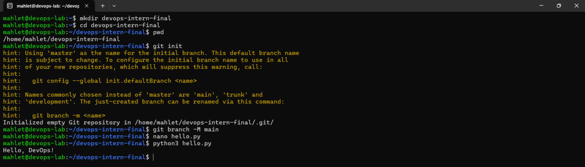
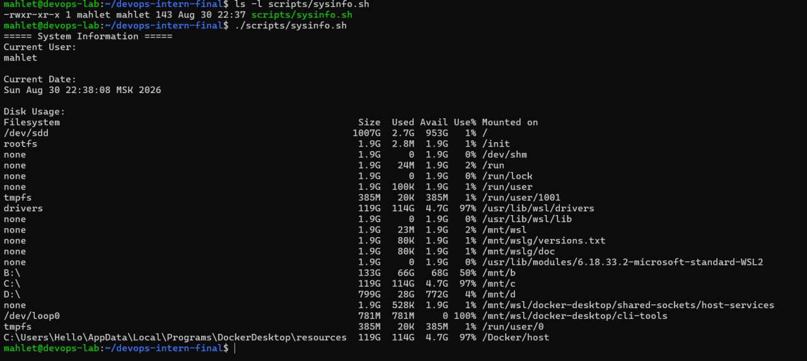
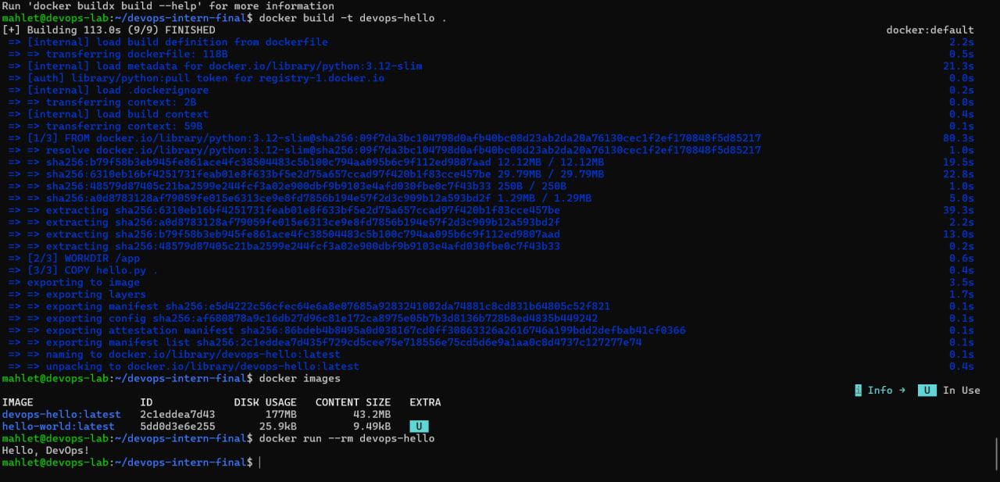
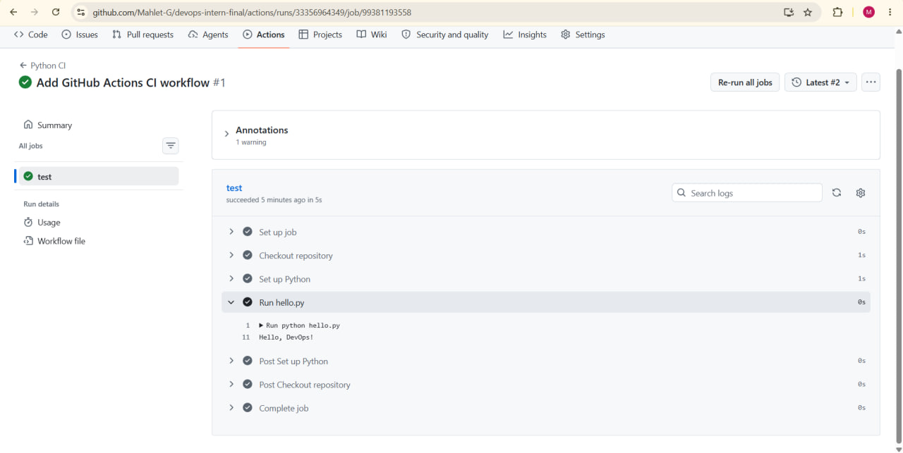
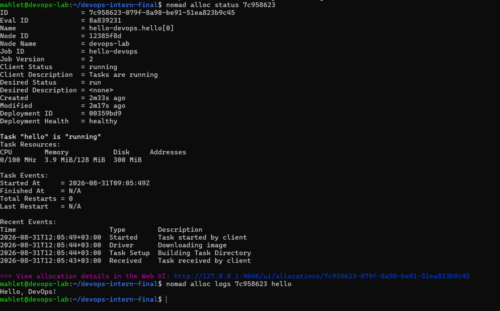
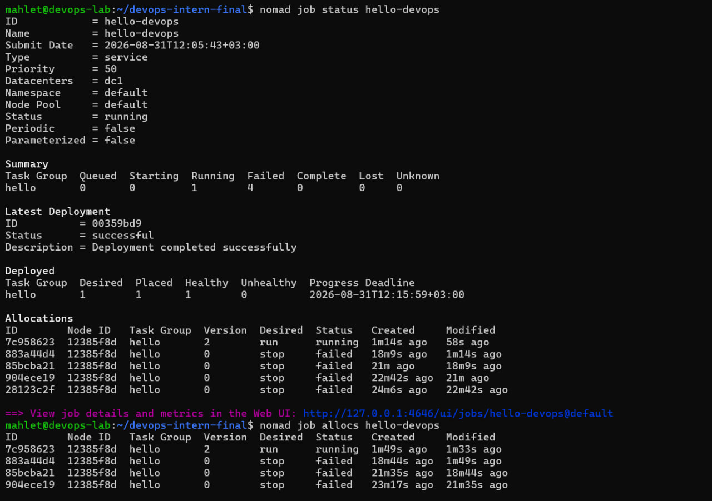
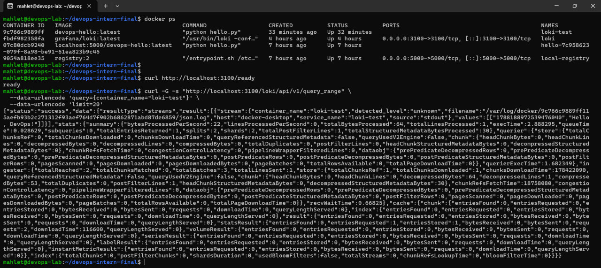

# DevOps Intern Final Assessment


**Name:** Mahlet Girma
**Date:** August 31, 2026

## Project Description

This project demonstrates a basic DevOps workflow using Linux, Git, GitHub, Docker, GitHub Actions, HashiCorp Nomad, and Grafana Loki.

## Architecture

```text
GitHub
   ↓
GitHub Actions
   ↓
Docker
   ↓
Local Registry
   ↓
Nomad
   ↓
Container
   ↓
Loki
   ↓
LogQL / Loki HTTP API
```

---

## 1. Git & GitHub

The project was initialized as a public GitHub repository containing the application source code, configuration files, scripts, documentation, and screenshots.

### Application

The Python application is located in:

```text
hello.py
```

The application prints:

```text
Hello, DevOps!
```

### Evidence



---

## 2. Linux & Bash

A Bash script was created to demonstrate basic Linux system administration and scripting.

### Script

```text
scripts/sysinfo.sh
```

The script displays:

* Current user
* Current date
* Disk usage

### Run the script

```bash
./scripts/sysinfo.sh
```

### Evidence



---

## 3. Docker

The Python application was containerized using Docker.

### Build the Docker image

```bash
docker build -t devops-hello .
```

### Run the Docker container

```bash
docker run -d --name devops-test devops-hello:latest
```

### Check the running container

```bash
docker ps
```

### View application logs

```bash
docker logs devops-test
```

Expected output:

```text
Hello, DevOps!
```

### Stop and remove the test container

```bash
docker stop devops-test
docker rm devops-test
```

### Evidence



---

## 4. GitHub Actions

A GitHub Actions workflow was created to automatically run the Python application on every push.

### Workflow

```text
.github/workflows/ci.yml
```

The workflow executes:

```bash
python hello.py
```

The workflow status is displayed using the CI badge at the top of this README.

### Evidence



---

## 5. Job Deployment with Nomad

The Docker container was deployed and managed as a service using HashiCorp Nomad.

### Prerequisites

* Docker
* HashiCorp Nomad
* A running Nomad agent
* Docker image available in the local registry

### Start the local Docker registry

```bash
docker run -d \
  --name local-registry \
  -p 5000:5000 \
  --restart=always \
  registry:2
```

### Tag the Docker image

```bash
docker tag devops-hello:latest localhost:5000/devops-hello:latest
```

### Push the Docker image to the local registry

```bash
docker push localhost:5000/devops-hello:latest
```

### Verify the image in the registry

```bash
curl http://localhost:5000/v2/_catalog
```

Expected output:

```json
{"repositories":["devops-hello"]}
```

```bash
curl http://localhost:5000/v2/devops-hello/tags/list
```

Expected output:

```json
{"name":"devops-hello","tags":["latest"]}
```

### Nomad Job File

The Nomad job definition is located at:

```text
nomad/hello.nomad
```

The job uses:

* `type = "service"`
* Docker driver
* 1 task instance
* 100 MHz CPU
* 128 MB memory

### Validate the Nomad job

```bash
nomad job validate nomad/hello.nomad
```

Expected output:

```text
Job validation successful
```

### Deploy the Nomad job

```bash
nomad job run nomad/hello.nomad
```

### Check the Nomad job status

```bash
nomad job status hello-devops
```

Expected status:

```text
Status = running
```

### Check the allocation

```bash
nomad job allocs hello-devops
```

Copy the allocation ID and run:

```bash
nomad alloc status <ALLOCATION_ID>
```

Expected status:

```text
Client Status     = running
Deployment Health = healthy
```

### View application logs

```bash
nomad alloc logs <ALLOCATION_ID> hello
```

Expected output:

```text
Hello, DevOps!
```

### Nomad Web UI

```text
http://127.0.0.1:4646/ui
```

The `hello-devops` job should appear as running and healthy.

### Stop the Nomad job

```bash
nomad job stop hello-devops
```

### Evidence





---

## 6. Monitoring with Grafana Loki

Grafana Loki was configured as a local log aggregation system for the Dockerized Python application.

### Log Flow

```text
Docker Container
       |
       v
Loki Docker Logging Driver
       |
       v
Grafana Loki
       |
       v
Loki HTTP API / LogQL
```

### Start Loki

```bash
docker run -d \
  --name loki \
  -p 3100:3100 \
  grafana/loki:latest
```

### Verify Loki

```bash
curl http://localhost:3100/ready
```

Expected output:

```text
ready
```

### Install the Loki Docker Logging Driver

```bash
docker plugin install grafana/loki-docker-driver:latest \
  --alias loki \
  --grant-all-permissions
```

### Verify the plugin

```bash
docker plugin ls
```

The Loki logging driver should be enabled.

### Run the Application with Loki Logging

```bash
docker run -d \
  --name loki-test \
  --log-driver=loki \
  --log-opt=loki-url=http://host.docker.internal:3100/loki/api/v1/push \
  devops-hello:latest
```

### Verify the Container

```bash
docker ps
```

### View Container Logs

```bash
docker logs loki-test
```

Expected output:

```text
Hello, DevOps!
```

### Query Logs from Loki

Logs were queried directly from the Loki HTTP API using LogQL:

```bash
curl -G -s "http://localhost:3100/loki/api/v1/query_range" \
  --data-urlencode 'query={container_name="loki-test"}' \
  --data-urlencode 'limit=20'
```

The query successfully returned:

```text
Hello, DevOps!
```

### Evidence



---

## Project Structure

```text
devops-intern-final/
├── .github/
│   └── workflows/
│       └── ci.yml
├── nomad/
│   └── hello.nomad
├── scripts/
│   └── sysinfo.sh
├── monitoring/
│   └── loki_setup.txt
├── screenshots/
│   ├── 01-github-repository.jpg
│   ├── 02-linux-script.jpg
│   ├── 03-docker-container.jpg
│   ├── 04-github-actions.jpg
│   ├── 05-nomad-deployment1.jpg
│   ├── 06-nomad-deployment2.jpg
│   └── 07-loki-logs.jpg
├── hello.py
├── Dockerfile
└── README.md
```
